# Informe Experimental: Comparación de Tiempos de Ejecución en un B-tree con Diferentes Valores de `MAX_KEYS`

**Integrantes:**
- Huamaní Vásquez Juan José
- Valdivia Vásquez Gian Pool
- Zela Flores Gabriel Frank

### Resumen

Este código implementa un B-tree que permite la inserción de claves y la generación de un archivo de visualización en formato DOT. La estructura del árbol cambia según el valor de `MAX_KEYS`, lo que define el número máximo de claves por nodo y afecta la profundidad del árbol y la eficiencia en operaciones de inserción y búsqueda.

El objetivo de este experimento es evaluar el rendimiento del B-tree al variar `MAX_KEYS` entre 3 , 4 y 5. Para ello:
- Se mide el **tiempo de carga de datos** al insertar claves desde un archivo CSV en el árbol.
- Se mide el **tiempo de búsqueda** para una clave específica en el árbol generado.

---

### Objetivo
Este experimento evalúa el impacto de utilizar diferentes valores para la variable `MAX_KEYS` en un B-tree, específicamente `MAX_KEYS = 3`, `MAX_KEYS = 4` y `MAX_KEYS = 5`. Se mide y compara el tiempo de ejecución en dos operaciones principales:
1. **Carga de datos**: el tiempo que tarda en insertar datos en el B-tree desde un archivo CSV.
2. **Búsqueda de una clave**: el tiempo que tarda en buscar una clave específica en el árbol ya construido.

---

### Metodología
Para llevar a cabo este experimento, el código fue modificado para medir el tiempo de ejecución de las operaciones de carga y búsqueda. Se utilizó la función `clock()` de la biblioteca `<time.h>` para registrar los tiempos.

---

### Descripción de Archivos

- **`main.c`**: Archivo principal que ejecuta el programa. Incluye la medición de tiempos para operaciones de búsqueda en el B-tree utilizando los datos de un archivo CSV.
- **`b_tree.h`**: Archivo de cabecera que define la estructura del B-tree, las constantes y los prototipos de funciones esenciales.
- **`b_tree.c`**: Archivo de implementación para las funciones definidas en `b_tree.h`.
- **`data/random_numbers_1000000.csv`**: Archivo de entrada que contiene datos de prueba para insertar en el B-tree.
- **`output/btree.dot`**: Archivo generado en formato DOT para visualizar la estructura del B-tree.

---

### Librerías Utilizadas

1. **`<stdio.h>`**: Proporciona funciones para entrada y salida estándar. En este código, se utiliza para:
   - **Impresión de mensajes** en la consola (`printf`), como las notificaciones de errores y el resultado del árbol B.
   - **Manejo de archivos** (`fopen`, `fprintf`, `fclose`) para generar el archivo `.dot` para visualización del árbol.

2. **`<stdlib.h>`**: Incluye funciones de utilidad general para:
   - **Asignación de memoria dinámica** (`malloc` y `free`), utilizada al crear y liberar nodos en el B-tree.
   - **Conversión de datos** (`atoi` y `atof`) en la función de importación de datos desde el archivo CSV.

3. **`<string.h>`**: Contiene funciones para la manipulación de cadenas. Se usa principalmente para:
   - **Dividir y procesar líneas** en la función `importCSVAndCreateBTree` mediante `strtok` para extraer claves individuales desde el archivo CSV.

4. **`<time.h>`**: Biblioteca de funciones de tiempo utilizada en `main.c` para:
   - **Medición de tiempos de ejecución** (`clock`) durante la carga de datos y la búsqueda en el B-tree, con el fin de comparar el rendimiento para diferentes valores de `MAX_KEYS`.

5. **Estructuras y Funciones Principales para el B-tree**:
   - **`btreeNode`**: Representa el nodo del B-tree, que contiene las claves y punteros a sus nodos hijos.
   - **`insert`**: Función principal para insertar una clave en el árbol B. Si el nodo raíz está lleno, llama a `splitChild`.
   - **`splitChild`**: Divide un nodo lleno en dos nodos, redistribuyendo las claves y ajustando punteros para mantener la estructura del B-tree.
   - **`insertNonFull`**: Inserta una clave en un nodo que no está lleno. Este es un subproceso de `insert`.
   - **`insertkey`**: Añade una clave en el lugar correcto dentro de un nodo.
   - **`printInOrder`**: Función que imprime el árbol en orden para visualizar la estructura actual del B-tree.

---

### Código de `main.c`

Este archivo contiene el código principal del programa. Ejecuta la carga de datos en el B-tree y mide el tiempo de búsqueda de una clave específica.

```c
#include <stdio.h>
#include <time.h>
#include "b_tree.h"

// INTEGRANTES:
// Huamani Vásquez Juan José
// Valdivia Vásquez Gian Pool
// Zela Flores Gabriel Frank

int main() {
    struct BTreeNode *root = NULL;
    struct timespec inicio, fin;
    long tiempo_transcurrido;

    const char *filename = "data/random_numbers_1000000.csv"; // Ruta del archivo CSV
    importCSVAndCreateBTree(filename, &root);
    
    clock_gettime(CLOCK_MONOTONIC, &inicio);
    int searched = search(root, 6677025);  // Buscar clave específica en el árbol
    clock_gettime(CLOCK_MONOTONIC, &fin);

    tiempo_transcurrido = (fin.tv_sec - inicio.tv_sec) * 1000000000L + (fin.tv_nsec - inicio.tv_nsec);
    
    printf("Número encontrado (0/1): %d\n", searched);
    printf("Tiempo de búsqueda: %ld nanosegundos\n", tiempo_transcurrido);
    
    return 0;
}
```

---

### Código de `b_tree.h`

Este archivo de cabecera define la estructura del nodo `BTreeNode`, las constantes `MAX_KEYS` y `DECIMALES`, así como los prototipos de las funciones principales.

```c
#ifndef B_TREE_H
#define B_TREE_H

#include <stdio.h>
#include <stdlib.h>

#define MAX_KEYS 5      // Máximo número de claves por nodo
#define DECIMALES 10000000

// Estructura del nodo en el B-tree
struct BTreeNode {
    int num_keys;
    int keys[MAX_KEYS];
    struct BTreeNode *children[MAX_KEYS + 1];
};

// Prototipos de funciones para manipulación del B-tree
struct BTreeNode *createNode();
void insert(struct BTreeNode **root, int key);
void splitChild(struct BTreeNode *parent, int index);
void insertNonFull(struct BTreeNode *node, int key);
void insertKey(struct BTreeNode *node, int key);
void printInOrder(struct BTreeNode *node);
void generateDotFile(struct BTreeNode *root, const char *filename);
void writeNode(FILE *file, struct BTreeNode *node, int *nodeCount);
void importCSVAndCreateBTree(const char *filename, struct BTreeNode **root);
int search(struct BTreeNode *node, int key);

#endif // B_TREE_H
```

---

### Código de `b_tree.c`

Implementa todas las funciones necesarias para crear y gestionar un B-tree, desde la inserción y división de nodos hasta la búsqueda de claves y la generación de un archivo .dot para la visualización.

```c
#include <stdio.h>
#include <stdlib.h>
#include <string.h>
#include "b_tree.h"

// Crea un nuevo nodo del B-tree
struct BTreeNode *createNode() {
    struct BTreeNode *newNode = (struct BTreeNode *)malloc(sizeof(struct BTreeNode));
    if (newNode == NULL) {
        printf("La asignación de memoria falló.\n");
        exit(1);
    }
    newNode->num_keys = 0;
    for (int i = 0; i < MAX_KEYS + 1; i++) {
        newNode->children[i] = NULL;
    }
    return newNode;
}

// Inserta una clave en el B-tree
void insert(struct BTreeNode **root, int key) {
    if (*root == NULL) {
        *root = createNode();
        (*root)->keys[0] = key;
        (*root)->num_keys = 1;
    } else {
        if ((*root)->num_keys == MAX_KEYS) {
            struct BTreeNode *newRoot = createNode();
            newRoot->children[0] = *root;
            splitChild(newRoot, 0);
            *root = newRoot;
            int i = (key > newRoot->keys[0]) ? 1 : 0;
            insertNonFull(newRoot->children[i], key);
        } else {
            insertNonFull(*root, key);
        }
    }
}

// Divide un nodo lleno y ajusta la estructura del B-tree
void splitChild(struct BTreeNode *parent, int index) {
    struct BTreeNode *child = parent->children[index];
    struct BTreeNode *newChild = createNode();
    int medianIndex = MAX_KEYS / 2;

    newChild->num_keys = MAX_KEYS - medianIndex - 1;
    for (int i = 0; i < newChild->num_keys; i++) {
        newChild->keys[i] = child->keys[i + medianIndex + 1];
    }

    if (child->children[0] != NULL) {
        for (int i = 0; i <= newChild->num_keys; i++) {
            newChild->children[i] = child->children[i + medianIndex + 1];
        }
    }

    child->num_keys = medianIndex;
    for (int i = parent->num_keys; i > index; i--) {
        parent->children[i + 1] = parent->children[i];
    }
    parent->children[index + 1] = newChild;

    for (int i = parent->num_keys; i > index; i--) {
        parent->keys[i] = parent->keys[i - 1];
    }
    parent->keys[index] = child->keys[medianIndex];
    parent->num_keys++;
}

// Inserta una clave en un nodo que no está lleno
void insertNonFull(struct BTreeNode *node, int key) {
    int i = node->num_keys - 1;
    if (node->children[0] == NULL) {
        insertKey(node, key);
        return;
    }

    while (i >= 0 && node->keys[i] > key) {
        i--;
    }
    i++;
    if (node->children[i]->num_keys == MAX_KEYS) {
        splitChild(node, i);
        if (node->keys[i] < key) {
            i++;
        }
    }
    insertNonFull(node->children[i], key);
}

// Inserta una clave directamente en un nodo
void insertKey(struct BTreeNode *node, int key) {
    int i = node->num_keys - 1;
    while (i >= 0 && node->keys[i] > key) {
        node->keys[i + 1] = node->keys[i];
        i--;
    }
    node->keys[i + 1] = key;
    node->num_keys++;
}

// Imprime las claves en orden ascendente
void printInOrder(struct BTreeNode *node) {
    if (node == NULL) return;

    for (int i = 0; i < node->num_keys; i++) {
        printInOrder(node->children[i]);
        printf("%d ", node->keys[i]);
    }
    printInOrder(node->children[node->num_keys]);
}

// Genera un archivo DOT para visualizar el B-tree
void generateDotFile(struct BTreeNode *root, const char *filename) {
    FILE *file = fopen(filename, "w");
    if (file == NULL) {
        printf("No se pudo abrir el archivo %s\n", filename);
        return;
    }

    fprintf(file, "digraph BTree {\n");
    fprintf(file, "    node [shape=record];\n");

    int nodeCount = 0;
    writeNode(file, root, &nodeCount);

    fprintf(file, "}\n");
    fclose(file);
    printf("Archivo DOT generado correctamente en %s\n", filename);
}

// Escribe recursivamente los nodos y sus conexiones en el archivo DOT
void writeNode(FILE *file, struct BTreeNode *node, int *nodeCount) {
    if (node == NULL) return;

    int currentNode = (*nodeCount)++;
    fprintf(file, "    node%d [label=\"", currentNode);

    int lastPortIndex = 0;
    for (int i = 0; i < node->num_keys; i++) {
        if (i > 0) fprintf(file, " | ");
        lastPortIndex = i * 2;
        fprintf(file, "<f%d>%d", lastPortIndex, node->keys[i]);
        if (i < node->num_keys - 1) fprintf(file, " | <f%d>", lastPortIndex + 1);
    }

    fprintf(file, " | <f%d>", lastPortIndex + 1);
    fprintf(file, "\"];\n");

    int childPortIndex = 0;
    for (int i = 0; i <= node->num_keys; i++) {
        if (node->children[i] != NULL) {
            int childNode = *nodeCount;
            writeNode(file, node->children[i], nodeCount);

            childPortIndex = (i == 0) ? 0 : (i == 1) ? 1 : (i * 2) - 1;
            fprintf(file, "    node%d:f%d -> node%d:f0;\n", currentNode, childPortIndex, childNode);
        }
    }
}

// Importa claves de un archivo CSV y las inserta en el B-tree
void importCSVAndCreateBTree(const char *filename, struct BTreeNode **root) {
    FILE *file = fopen(filename, "r");
    if (file == NULL) {
        printf("No se pudo abrir el archivo %s\n", filename);
        return;
    }

    char line[256];
    fgets(line, sizeof(line), file);

    while (fgets(line, sizeof(line), file)) {
        char *token = strtok(line, ",");
        token = strtok(NULL, ",");
        if (token != NULL) {
            double value = atof(token);
            int key = (int)(value * DECIMALES);
            if (!search(*root, key)) {
                insert(root, key);
            }
        }
    }

    fclose(file);
    printf("Datos importados y B-tree creado correctamente.\n");
}

// Busca una clave en el B-tree
int search(struct BTreeNode *node, int key) {
    while (node != NULL) {
        int i = 0;
        while (i < node->num_keys && key > node->keys[i]) {
            i++;
        }
        if (i < node->num_keys && key == node->keys[i]) {
            return 1;
        }
        node = node->children[i];
    }
    return 0;
}
```
---

### Visualización del B-tree

El siguiente archivo `.dot` permite la visualización de la estructura del B-tree utilizado en este experimento. Este archivo define los nodos y conexiones del árbol, y puede renderizarse usando herramientas de visualización como Graphviz. La estructura del árbol varía según el valor de `MAX_KEYS`, afectando la profundidad y distribución de las claves.

```dot
digraph BTree {
    node [shape=record];
    node0 [label="<f0>56 | <f1>"];
    node1 [label="<f0>19 | <f1> | <f2>40 | <f3>"];
    node2 [label="<f0>3 | <f1> | <f2>6 | <f3> | <f4>12 | <f5> | <f6>15 | <f7>"];
    node3 [label="<f0>0 | <f1> | <f2>1 | <f3> | <f4>2 | <f5>"];
    node2:f0 -> node3:f0;
    node4 [label="<f0>4 | <f1> | <f2>5 | <f3>"];
    node2:f1 -> node4:f0;
    node5 [label="<f0>7 | <f1> | <f2>8 | <f3> | <f4>9 | <f5> | <f6>10 | <f7> | <f8>11 | <f9>"];
    node2:f3 -> node5:f0;
    node6 [label="<f0>13 | <f1> | <f2>14 | <f3>"];
    node2:f5 -> node6:f0;
    node7 [label="<f0>16 | <f1> | <f2>17 | <f3> | <f4>18 | <f5>"];
    node2:f7 -> node7:f0;
    node1:f0 -> node2:f0;
    node8 [label="<f0>25 | <f1> | <f2>29 | <f3> | <f4>32 | <f5> | <f6>37 | <f7>"];
    node9 [label="<f0>20 | <f1> | <f2>21 | <f3> | <f4>22 | <f5> | <f6>23 | <f7> | <f8>24 | <f9>"];
    node8:f0 -> node9:f0;
    node10 [label="<f0>26 | <f1> | <f2>27 | <f3> | <f4>28 | <f5>"];
    node8:f1 -> node10:f0;
    node11 [label="<f0>30 | <f1> | <f2>31 | <f3>"];
    node8:f3 -> node11:f0;
    node12 [label="<f0>33 | <f1> | <f2>34 | <f3> | <f4>35 | <f5> | <f6>36 | <f7>"];
    node8:f5 -> node12:f0;
    node13 [label="<f0>38 | <f1> | <f2>39 | <f3>"];
    node8:f7 -> node13:f0;
    node1:f1 -> node8:f0;
    node14 [label="<f0>44 | <f1> | <f2>48 | <f3> | <f4>53 | <f5>"];
    node15 [label="<f0>41 | <f1> | <f2>42 | <f3> | <f4>43 | <f5>"];
    node14:f0 -> node15:f0;
    node16 [label="<f0>45 | <f1> | <f2>46 | <f3> | <f4>47 | <f5>"];
    node14:f1 -> node16:f0;
    node17 [label="<f0>49 | <f1> | <f2>50 | <f3> | <f4>51 | <f5> | <f6>52 | <f7>"];
    node14:f3 -> node17:f0;
    node18 [label="<f0>54 | <f1> | <f2>55 | <f3>"];
    node14:f5 -> node18:f0;
    node1:f3 -> node14:f0;
    node0:f0 -> node1:f0;
    node19 [label="<f0>69 | <f1> | <f2>84 | <f3>"];
    node20 [label="<f0>61 | <f1> | <f2>64 | <f3>"];
    node21 [label="<f0>57 | <f1> | <f2>58 | <f3> | <f4>59 | <f5> | <f6>60 | <f7>"];
    node20:f0 -> node21:f0;
    node22 [label="<f0>62 | <f1> | <f2>63 | <f3>"];
    node20:f1 -> node22:f0;
    node23 [label="<f0>65 | <f1> | <f2>66 | <f3> | <f4>67 | <f5> | <f6>68 | <f7>"];
    node20:f3 -> node23:f0;
    node19:f0 -> node20:f0;
    node24 [label="<f0>73 | <f1> | <f2>76 | <f3> | <f4>80 | <f5>"];
    node25 [label="<f0>70 | <f1> | <f2>71 | <f3> | <f4>72 | <f5>"];
    node24:f0 -> node25:f0;
    node26 [label="<f0>74 | <f1> | <f2>75 | <f3>"];
    node24:f1 -> node26:f0;
    node27 [label="<f0>77 | <f1> | <f2>78 | <f3> | <f4>79 | <f5>"];
    node24:f3 -> node27:f0;
    node28 [label="<f0>81 | <f1> | <f2>82 | <f3> | <f4>83 | <f5>"];
    node24:f5 -> node28:f0;
    node19:f1 -> node24:f0;
    node29 [label="<f0>88 | <f1> | <f2>91 | <f3> | <f4>95 | <f5>"];
    node30 [label="<f0>85 | <f1> | <f2>86 | <f3> | <f4>87 | <f5>"];
    node29:f0 -> node30:f0;
    node31 [label="<f0>89 | <f1> | <f2>90 | <f3>"];
    node29:f1 -> node31:f0;
    node32 [label="<f0>92 | <f1> | <f2>93 | <f3> | <f4>94 | <f5>"];
    node29:f3 -> node32:f0;
    node33 [label="<f0>96 | <f1> | <f2>97 | <f3> | <f4>98 | <f5> | <f6>99 | <f7>"];
    node29:f5 -> node33:f0;
    node19:f3 -> node29:f0;
    node0:f1 -> node19:f0;
}
```



---

### Diagrama


---

1. **Configuración del archivo `b_tree.h`**:
   - Se varió el valor de `MAX_KEYS` entre 3, 4 y 5.
   - Se recompiló el código en cada caso y se ejecutaron las pruebas de tiempo.

2. **Operaciones Medidas**:
   - **Carga de datos**: el tiempo necesario para insertar todas las claves desde un archivo CSV en el B-tree.
   - **Búsqueda de una clave**: el tiempo necesario para buscar una clave específica en el B-tree.

3. **Parámetros del experimento**:
   - Archivo CSV: `random_numbers_1000000.csv` (contiene un millón de valores para insertar en el árbol).
   - Clave de búsqueda: Se seleccionó una clave de prueba (`CLAVE_BUSCAR = 5000`) para evaluar la búsqueda en el árbol después de la carga.
   - 
 ---

### Resultados Experimentales

| Configuración de `N° LLAVES` | Tiempo de Búsqueda (clave existe) (nanosegundos) | Tiempo de Búsqueda (clave no existe) (nanosegundos) |
|-----------------------------|---------------------------------------------------|-----------------------------------------------------|
| `N° LLAVES = 3`             | 983.9                                            | 897                                                 |
| `N° LLAVES = 4`             | 744.1                                            | 793                                                 |
| `N° LLAVES = 5`             | 414.7                                            | 654.9                                               |

> **Análisis de Resultados**:

1. **Búsqueda de Claves Existentes**:
   - **`N° LLAVES = 3`**: La búsqueda de una clave que existe en el árbol tarda un promedio de **983.9 nanosegundos**. Este es el tiempo más alto registrado entre las configuraciones de llaves, probablemente debido a la mayor profundidad del árbol al tener menos claves por nodo.
   - **`N° LLAVES = 4`**: Con cuatro claves por nodo, el tiempo disminuye a **744.1 nanosegundos**, lo que sugiere que el árbol es menos profundo y se requiere un menor número de operaciones para encontrar la clave.
   - **`N° LLAVES = 5`**: El tiempo de búsqueda baja aún más a **414.7 nanosegundos**, indicando una mejora significativa en la eficiencia al aumentar el número de claves por nodo. La menor profundidad del árbol permite alcanzar las claves con menos pasos.

2. **Búsqueda de Claves No Existentes**:
   - **`N° LLAVES = 3`**: Para claves que no existen en el árbol, el tiempo de búsqueda promedio es de **897 nanosegundos**. Aunque no se encuentra la clave, el árbol aún se recorre hasta los nodos hoja, resultando en un tiempo de búsqueda elevado.
   - **`N° LLAVES = 4`**: Al permitir cuatro claves por nodo, el tiempo de búsqueda para una clave inexistente se reduce a **793 nanosegundos**, lo que refleja una mejora debido a la estructura menos profunda del árbol.
   - **`N° LLAVES = 5`**: Con cinco claves por nodo, el tiempo baja a **654.9 nanosegundos**. Este es el tiempo más bajo entre las configuraciones probadas, sugiriendo que la eficiencia mejora conforme disminuye la profundidad del árbol.

> **Comparación y Observaciones Relevantes**:
   - **Profundidad y Eficiencia**: La reducción en la profundidad del árbol al aumentar `N° LLAVES` disminuye tanto el tiempo de búsqueda para claves existentes como para claves inexistentes.
   - **Rendimiento Óptimo en Búsquedas**: La configuración de `N° LLAVES = 5` demuestra ser la más eficiente, mostrando que un mayor número de claves por nodo reduce la cantidad de operaciones necesarias y, por ende, el tiempo de búsqueda.
   - **Impacto en Inserciones**: Aunque este experimento se centra en la búsqueda, una mayor cantidad de claves por nodo (`N° LLAVES = 5`) puede también mejorar el rendimiento de las inserciones, dado que se requerirían menos divisiones de nodos. Sin embargo, esto depende de las operaciones realizadas sobre el árbol.

> **Conclusión**:
   - Al aumentar el número de llaves por nodo (`N° LLAVES`), el tiempo de búsqueda se reduce tanto para claves existentes como para claves no existentes en el árbol.
   - La configuración de `N° LLAVES = 5` ofrece el mejor rendimiento, lo que sugiere que el árbol, al ser menos profundo, permite una búsqueda más rápida al requerir menos comparaciones por nodo.


